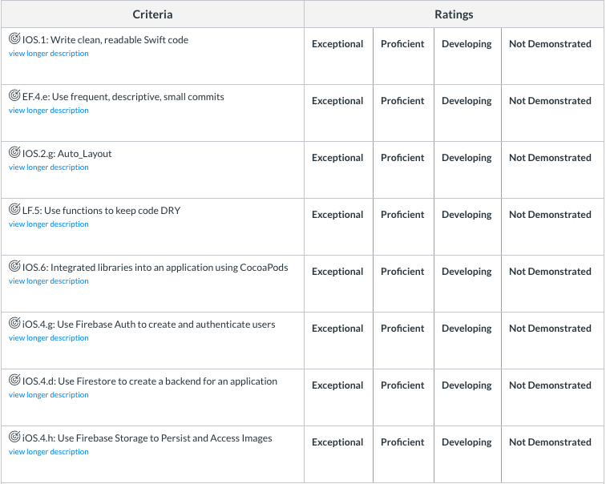

# firebase-practice-mock-instagram
Project Notes:
- You will need to "pod install" to download FirebaseAuth, FireStore, FirebaseStorage
- You will need to add your own Firebase Google plist to the project assets folder

# Pursuit-Core-iOS-Firebase-Project

For this project, build a Firebase-backed application where users can upload and view images.

## Requirements

- Users can create an account and sign in
- Users can change their display name and profile image
- Users can upload an image
- Users can view images uploaded by other users in their feed
- Users can select an uploaded image to see more information about it

## Technologies

- [Firebase - Auth](https://firebase.google.com/docs/auth)
- [Firebase - Cloud Firestore](https://firebase.google.com/docs/firestore)
- [Firebase - Storage](https://firebase.google.com/docs/storage)

## Rubric

## UI

You are free to design the UI for it, but the following wireframes provide a rough sketch of the desired screens:

### Login View Controller

### Profile View Controller

### Feed View Controller

### Image Upload View Controller

### Image Detail View Controller

